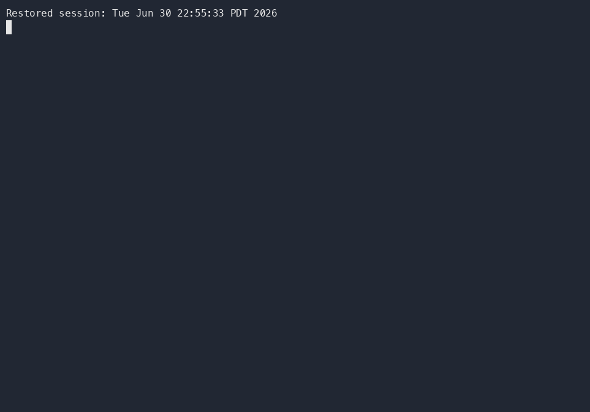

# pi-lynx

Give Pi agents plain-text web search and page fetch with no API keys, using your local `lynx` plus DuckDuckGo Lite. Body text first; links are opt-in and capped.

[Install](#install) | [Quick start](#quick-start) | [Demo](#demo) | [Tools](#tools) | [Failure modes](#failure-modes)

> Early v1.x. Search parses DuckDuckGo Lite's unofficial HTML and may throttle or break without notice. Requires `lynx` on `PATH`. JS-heavy pages are not supported.

## Demo



Recorded terminal demo source: [`docs/demo/pi-lynx.cast`](docs/demo/pi-lynx.cast)

Play locally:

```bash
asciinema play docs/demo/pi-lynx.cast
```

The demo shows:

- `pi install npm:pi-lynx`
- `lynx` available on `PATH`
- Pi using `pi-lynx` for web search/page fetch
- bounded, body-text-first output
- links as opt-in context

## Install

```bash
pi install npm:pi-lynx
```

Then reload or restart pi:

```text
/reload
```

### Requirements

- [lynx](https://lynx.invisible-island.net/) installed and on `PATH`
- Pi coding agent

### Quick start

Search:

```text
lynx_web_search: rust language
```

Fetch page text only:

```text
lynx_web_fetch: https://example.com
```

Fetch with links:

```text
lynx_web_fetch: https://example.com {"include_links": true, "link_limit": 20}
```

### Alternative: install from git

```bash
pi install git:github.com/dabito/pi-lynx
```

### Alternative: install from source

```bash
git clone https://github.com/dabito/pi-lynx.git
cd pi-lynx
npm install
pi -e .
```

## Tools

### Tool composition

Tools are composed in a layered hierarchy to avoid duplication:

```text
lynx_web_fetch            ← base layer (lynx -dump + parse)
  ↑ used by
lynx_web_search           ← DDG Lite URL construction + result parsing
  ↑ used by
lynx_web_search_github    ← convenience wrapper (pre-set site:github.com)
lynx_web_search_wikipedia ← convenience wrapper (pre-set site:wikipedia.org)
```

### `lynx_web_fetch`

Fetch a web page and extract its text content using lynx. Links are opt-in and capped by default.

| Name            | Type    | Required | Default | Description                                              |
| --------------- | ------- | -------- | ------- | -------------------------------------------------------- |
| `url`           | string  | ✓        | —       | URL to fetch                                             |
| `max_lines`     | number  |          | 300     | Max lines of body text (50–2000)                         |
| `include_links` | boolean |          | false   | Include extracted links section                           |
| `link_limit`    | number  |          | 20      | Max links when `include_links=true`                      |

### `lynx_web_search`

Search the web using DuckDuckGo Lite. Returns structured results with titles, snippets, domains, and URLs.

| Name          | Type   | Required | Default | Description                                     |
| ------------- | ------ | -------- | ------- | ----------------------------------------------- |
| `query`       | string | ✓        | —       | Search query; supports `!gh` and `!w` shortcuts |
| `max_results` | number |          | 8       | Max results to return (1–20)                    |
| `site`        | string |          | —       | Restrict to `"github"` or `"wikipedia"`       |

Shortcuts:

- `!gh <query>` or `site: "github"` → restricts to GitHub
- `!w <query>` or `site: "wikipedia"` → restricts to Wikipedia

If both a bang shortcut and an explicit site filter are provided, the explicit filter wins. For example, `query: "!gh rust", site: "wikipedia"` searches Wikipedia for `rust`.

### `lynx_web_search_github`

Search GitHub using DuckDuckGo Lite. Convenience wrapper around `lynx_web_search` with `site:github.com` pre-set.

| Name          | Type   | Required | Default | Description          |
| ------------- | ------ | -------- | ------- | -------------------- |
| `query`       | string | ✓        | —       | Search query         |
| `max_results` | number |          | 8       | Max results to return |

### `lynx_web_search_wikipedia`

Search Wikipedia using DuckDuckGo Lite. Convenience wrapper around `lynx_web_search` with `site:wikipedia.org` pre-set.

| Name          | Type   | Required | Default | Description          |
| ------------- | ------ | -------- | ------- | -------------------- |
| `query`       | string | ✓        | —       | Search query         |
| `max_results` | number |          | 8       | Max results to return |

## Behavior notes

- `lynx_web_fetch` returns body text only by default.
- Links are explicit opt-in: set `include_links: true`.
- When links are included, they are capped by `link_limit`.
- `max_lines` caps body text only.
- DDG Lite site-filtered searches may throttle; `PI_LYNX_SITE_SEARCH_INTERVAL_MS` spaces them out.

## Failure modes

- Missing `lynx`: install it and ensure it is on `PATH`.
- Site-filtered search throttled: wait, or raise `PI_LYNX_SITE_SEARCH_INTERVAL_MS`.
- JS-heavy / browser-required pages: Lynx may not capture the interactive content.

## Configuration catalog

| Variable | Default | Min | Description |
| -------- | ------- | --- | ----------- |
| `PI_LYNX_SITE_SEARCH_INTERVAL_MS` | `3000` | `1000` | Minimum spacing between DDG Lite `site:` searches. Use `4000` or higher if DuckDuckGo throttles repeated GitHub/Wikipedia searches. |

## Command catalog

| Command | Purpose |
| ------- | ------- |
| `npm test` | Run fixture-based unit tests. Live DDG search stays skipped by default. |
| `PI_LYNX_INTEGRATION=1 npm test` | Run live DDG Lite integration tests. May throttle repeated `site:` searches. |
| `npm run typecheck` | Run strict TypeScript checking. |
| `npm run lint` | Run ESLint. |
| `npm pack --dry-run` | Preview publish tarball contents. |

## Notes on DuckDuckGo Lite

Raw DDG bangs such as `!gh` and `!w` redirect away from DDG Lite, so pi-lynx converts them to `site:` filters before searching.

DuckDuckGo Lite can temporarily rate-limit repeated `site:` searches. pi-lynx spaces site-filtered searches by at least 3 seconds by default; tune with `PI_LYNX_SITE_SEARCH_INTERVAL_MS`.

## How it works

1. `lynx_web_fetch` runs `lynx -dump` on a URL to get plain text.
2. The `References` section is parsed to build a `[N] → URL` mapping.
3. DDG redirect URLs (`duckduckgo.com/l/?uddg=...`) are resolved to real target URLs.
4. `[N]` markers are stripped from body text for clean output.
5. `lynx_web_search` constructs a DDG Lite URL and parses search results.
6. Site-specific tools call `lynx_web_search` with the appropriate `site:` filter.

## Development

```bash
npm test
npm run typecheck
```

Unit tests use committed DuckDuckGo Lite fixtures in `test/fixtures`.

The live DDG Lite integration test is opt-in because repeated `site:` searches can be rate-limited:

```bash
PI_LYNX_INTEGRATION=1 npm test
```

## Related packages

- `hledit` for stable, hash-anchored file editing.
- `pi-hledit` for Pi integration with `hledit`.
